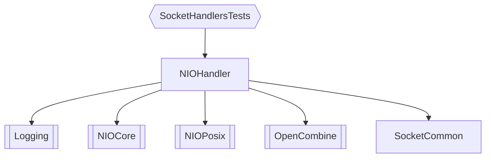
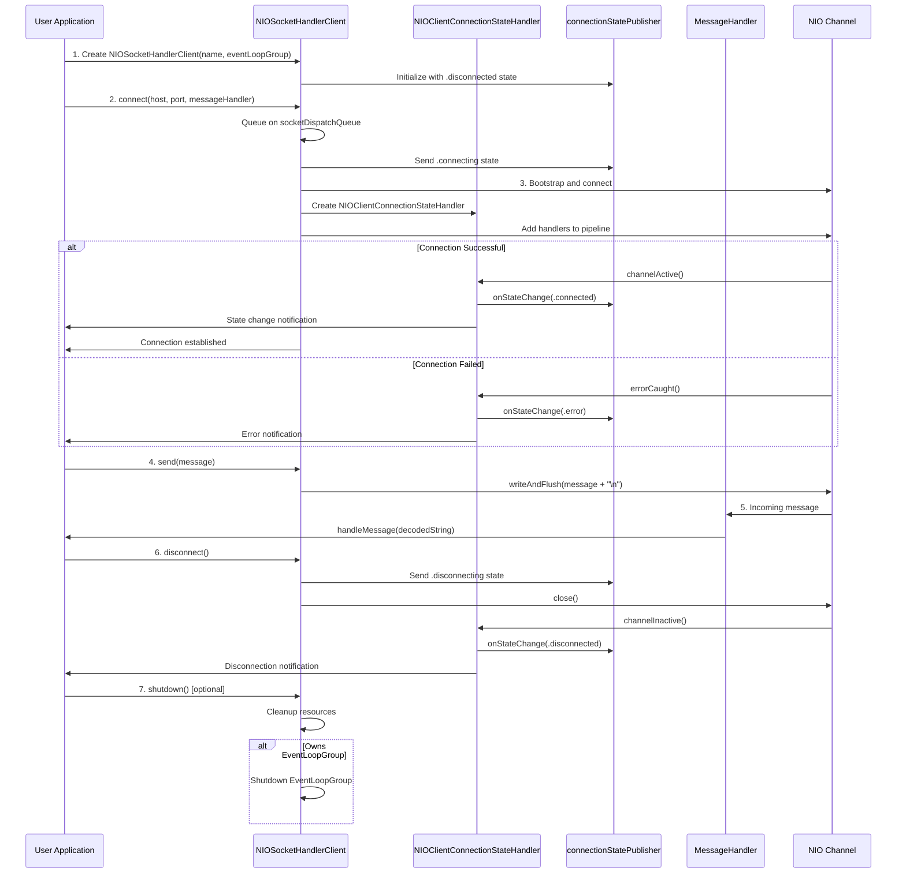

# NIO Socket Wrapper for Handling ASCII over TCP

A lightweight Swift wrapper around SwiftNIO for handling ASCII text communication over TCP sockets. This library provides an easy-to-use interface for both client and server socket implementations with built-in connection state management and reactive publishers using OpenCombine.

## Features

- **Simple API** - Easy-to-use client and server socket handlers
- **ASCII Text Protocol** - Optimized for text-based communication
- **Connection State Management** - Built-in state tracking and notifications
- **SwiftNIO Powered** - High-performance asynchronous networking
- **Reactive** - OpenCombine publishers for state changes
- **Well Tested** - Comprehensive test suite included
- **Cross Platform** - Works on macOS and Linux

## Layout:

## Example User Implementation for Client:

## Planned:

- add timeout and reconnect handling.
- option for handling/tokenzing datastreams enabling modbus to plug in here.
- Some examples for easier community adoption.
