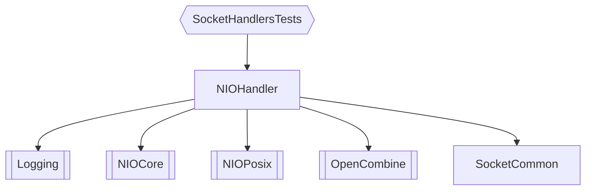
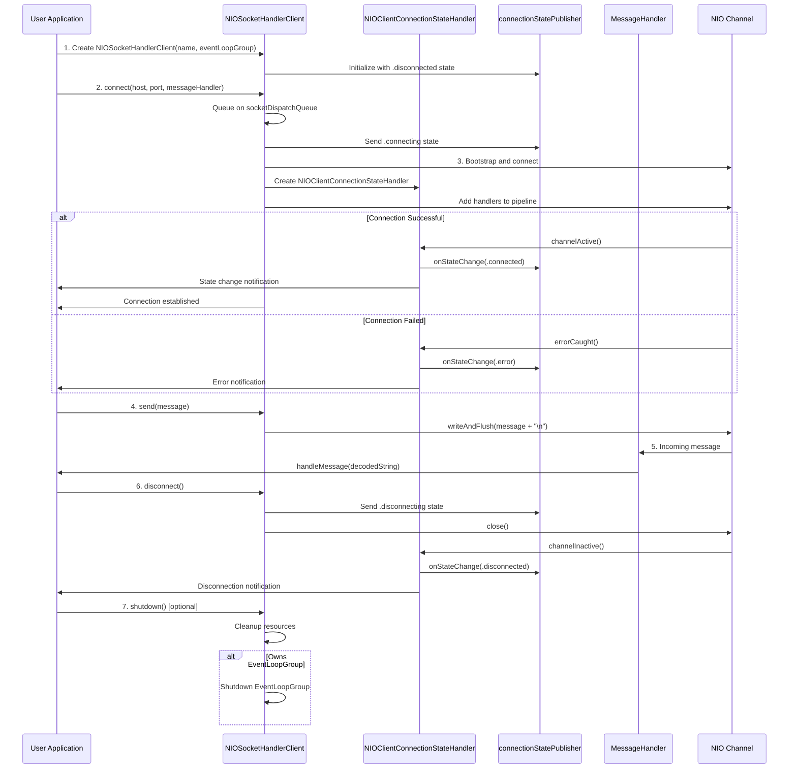

# NIO Socket Wrapper for Handling Ascii over TCP

## Layout:

```mermaid
flowchart TD
    NIOHandler-->Logging[[Logging]]
    NIOHandler-->NIOCore[[NIOCore]]
    NIOHandler-->NIOPosix[[NIOPosix]]
    NIOHandler-->OpenCombine[[OpenCombine]]
    NIOHandler-->SocketCommon
    SocketCommon
    SocketHandlersTests{{SocketHandlersTests}}-->NIOHandler
```

## Example User Implementation for Client:

```mermaid
sequenceDiagram
    participant User as User Application
    participant Client as NIOSocketHandlerClient
    participant StateHandler as NIOClientConnectionStateHandler
    participant Publisher as connectionStatePublisher
    participant Handler as MessageHandler
    participant Channel as NIO Channel

    User->>Client: 1. Create NIOSocketHandlerClient(name, eventLoopGroup)
    Client->>Publisher: Initialize with .disconnected state
    
    User->>Client: 2. connect(host, port, messageHandler)
    Client->>Client: Queue on socketDispatchQueue
    Client->>Publisher: Send .connecting state
    
    Client->>Channel: 3. Bootstrap and connect
    Client->>StateHandler: Create NIOClientConnectionStateHandler
    Client->>Channel: Add handlers to pipeline
    
    alt Connection Successful
        Channel->>StateHandler: channelActive()
        StateHandler->>Publisher: onStateChange(.connected)
        StateHandler->>User: State change notification
        Client->>User: Connection established
    else Connection Failed
        Channel->>StateHandler: errorCaught()
        StateHandler->>Publisher: onStateChange(.error)
        StateHandler->>User: Error notification
    end

    User->>Client: 4. send(message)
    Client->>Channel: writeAndFlush(message + "\n")
    
    Channel->>Handler: 5. Incoming message
    Handler->>User: handleMessage(decodedString)
    
    User->>Client: 6. disconnect()
    Client->>Publisher: Send .disconnecting state
    Client->>Channel: close()
    
    Channel->>StateHandler: channelInactive()
    StateHandler->>Publisher: onStateChange(.disconnected)
    StateHandler->>User: Disconnection notification
    
    User->>Client: 7. shutdown() [optional]
    Client->>Client: Cleanup resources
    alt Owns EventLoopGroup
        Client->>Client: Shutdown EventLoopGroup
    end
```