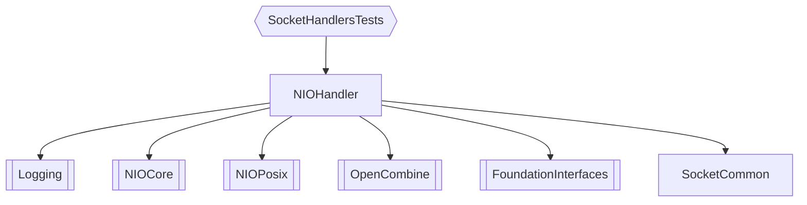
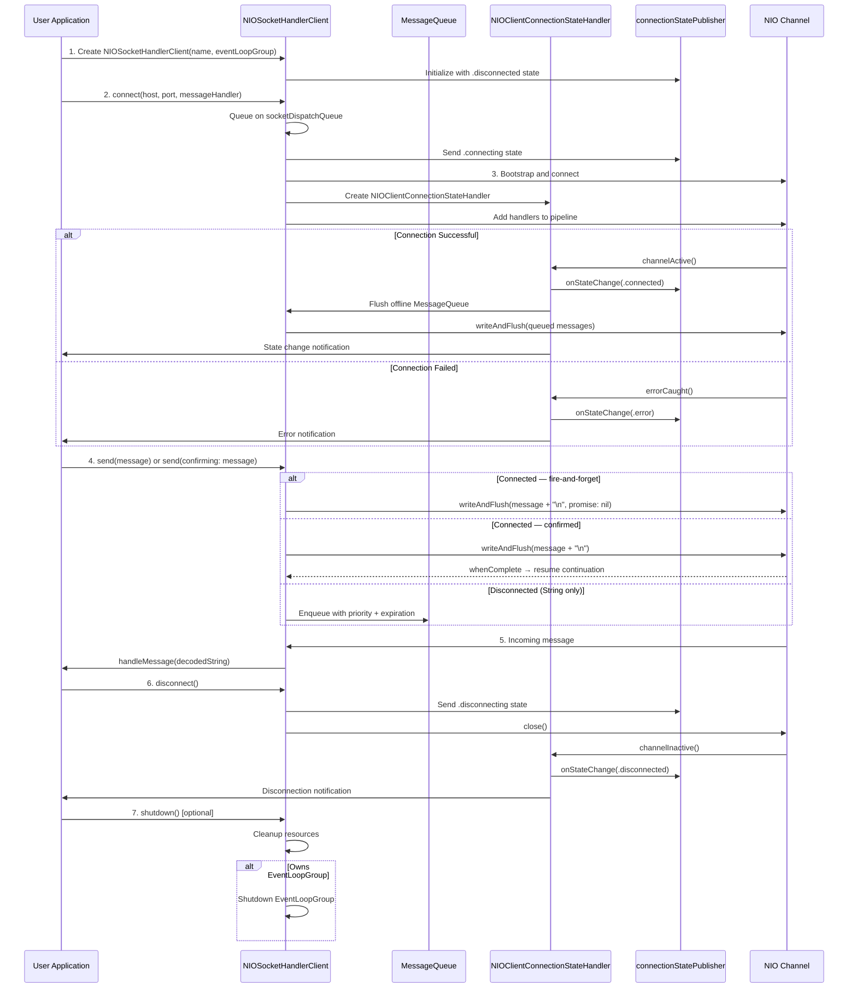

# NIO Socket Wrapper for Handling ASCII over TCP

[](https://swift.org)
[-lightgrey.svg)](https://swift.org)
[](https://github.com/apple/swift-nio)
[](LICENSE)

A lightweight Swift wrapper around SwiftNIO for handling ASCII text communication over TCP sockets. Provides an easy-to-use client and server interface with built-in connection state management, offline message queuing, and reactive state publishers via OpenCombine.

## Features

- **Simple API** — Single-object facade: one `NIOSocketHandlerServer`, one `NIOSocketHandlerClient`. No NIO primitives exposed.
- **Text and Binary Sends** — `send(_: String)` for newline-delimited text (delimiter appended automatically); `send(_: Data)` for raw binary payloads
- **Confirmed Delivery** — `send(confirming: String) async throws` and `send(confirming: Data) async throws` suspend until the write is flushed to the kernel or throw on failure
- **Connection State Management** — Built-in state tracking with OpenCombine publishers for reactive observation
- **SwiftNIO Powered** — High-performance asynchronous networking built on Apple's SwiftNIO
- **Offline Message Queue** — Priority queue with configurable expiration; String messages are buffered while disconnected and flushed automatically on reconnect
- **Buffer Safety** — Configurable `maxCumulationBufferSize` (default 1 MB) in `ServerConfiguration`/`ClientConfiguration`; channel closed automatically if a peer sends data without delimiters
- **Retry Policy** — Configurable reconnection with exponential backoff or fixed delay strategies
- **`MessageDuplex` Conformance** — Both server and client conform to `MessageSendable` + `MessageReceivable` from `FoundationInterfaces`
- **Stress Tested** — 10k–15k message throughput tests with deterministic and variable timing


## Layout


```mermaid
flowchart TD
    NIOHandler-->Logging[[Logging]]
    NIOHandler-->NIOCore[[NIOCore]]
    NIOHandler-->NIOPosix[[NIOPosix]]
    NIOHandler-->OpenCombine[[OpenCombine]]
    NIOHandler-->FoundationInterfaces[[FoundationInterfaces]]
    NIOHandler-->SocketCommon
    SocketCommon
    SocketHandlersTests{{SocketHandlersTests}}-->NIOHandler
```

## Client Usage Example

```swift
import NIOHandler
import NIOPosix

let group = MultiThreadedEventLoopGroup(numberOfThreads: 1)
let client = NIOSocketHandlerClient(name: "my-client", eventLoopGroup: group)

// Observe connection state reactively
client.connectionStatePublisher.sink { state in
    print("State: \(state)")
}.store(in: &cancellables)

// Connect and register a message handler
try await client.connect(host: "127.0.0.1", port: 9000) { message in
    print("Received: \(message)")
}

// Fire-and-forget send (newline appended automatically)
client.send("hello")

// Confirmed send — suspends until flushed to kernel
try await client.send(confirming: "hello")

// Disconnect when done
client.disconnect()
```

## Server Usage Example

```swift
import NIOHandler
import NIOPosix

let server = NIOSocketHandlerServer(configuration: .default)

server.listeningStatePublisher.sink { state in
    print("Server: \(state)")
}.store(in: &cancellables)

try await server.listen(port: 9000) { message in
    print("Client said: \(message)")
}

// Fire-and-forget broadcast (newline appended automatically)
server.send("hello everyone")

// Confirmed send to a specific client
try await server.send(confirming: "hello", to: clientID)
```

## Client Connection Flow


```mermaid
sequenceDiagram
    participant User as User Application
    participant Client as NIOSocketHandlerClient
    participant Queue as MessageQueue
    participant StateHandler as NIOClientConnectionStateHandler
    participant Publisher as connectionStatePublisher
    participant Channel as NIO Channel

    User->>Client: 1. Create NIOSocketHandlerClient(name, eventLoopGroup)
    Client->>Publisher: Initialize with .disconnected state

    User->>Client: 2. connect(host, port, messageHandler)
    Client->>Client: Queue on socketDispatchQueue
    Client->>Publisher: Send .connecting state

    Client->>Channel: 3. Bootstrap and connect
    Client->>StateHandler: Create NIOClientConnectionStateHandler
    Client->>Channel: Add handlers to pipeline

    alt Connection Successful
        Channel->>StateHandler: channelActive()
        StateHandler->>Publisher: onStateChange(.connected)
        StateHandler->>Client: Flush offline MessageQueue
        Client->>Channel: writeAndFlush(queued messages)
        StateHandler->>User: State change notification
    else Connection Failed
        Channel->>StateHandler: errorCaught()
        StateHandler->>Publisher: onStateChange(.error)
        StateHandler->>User: Error notification
    end

    User->>Client: 4. send(message) or send(confirming: message)
    alt Connected — fire-and-forget
        Client->>Channel: writeAndFlush(message + "\n", promise: nil)
    else Connected — confirmed
        Client->>Channel: writeAndFlush(message + "\n")
        Channel-->>Client: whenComplete → resume continuation
    else Disconnected (String only)
        Client->>Queue: Enqueue with priority + expiration
    end

    Channel->>Client: 5. Incoming message
    Client->>User: handleMessage(decodedString)

    User->>Client: 6. disconnect()
    Client->>Publisher: Send .disconnecting state
    Client->>Channel: close()

    Channel->>StateHandler: channelInactive()
    StateHandler->>Publisher: onStateChange(.disconnected)
    StateHandler->>User: Disconnection notification

    User->>Client: 7. shutdown() [optional]
    Client->>Client: Cleanup resources
    alt Owns EventLoopGroup
        Client->>Client: Shutdown EventLoopGroup
    end
```


## Planned

- Timeout and reconnect handling improvements
- `MessageFramer` protocol abstraction to enable Modbus / length-prefixed / binary stream tokenization as plug-in conformances
- Community examples for easier adoption
